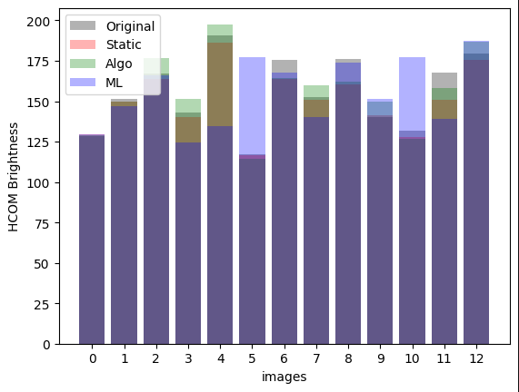
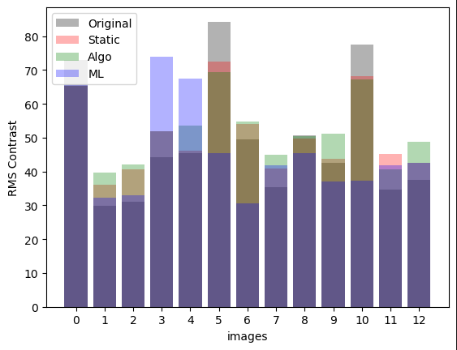
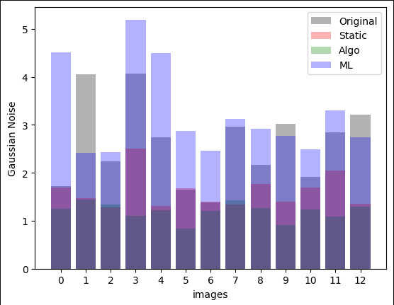
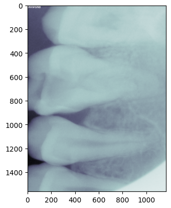
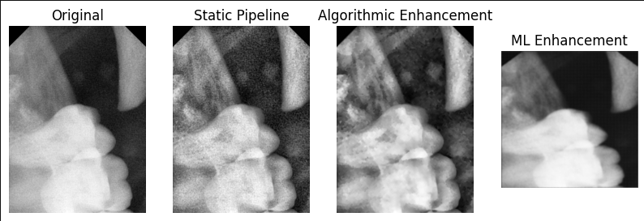

# X-ray Adaptive Preprocessing Pipeline

## 1. Introduction & Problem Understanding

Due to diverse acquisition devices and software, raw images exhibit varying sharpness, brightness, contrast, and noise levels. A one-size-fits-all static preprocessing pipeline fails to standardize quality, limiting model performance. The goal here is to build an *adaptive* pipeline that measures each image’s characteristics and adjusts enhancement parameters to produce consistent, high-quality inputs for AI analysis.

## 2. Dataset Description

* **Source**: A folder of sample IOPA X-rays in DICOM and common image formats (`.dcm`, `.png`, `.jpg`) located in `/Images_Data_science_intern`.
* **Loading & Handling**:

  * DICOM files are read via `pydicom`. Pixel arrays are extracted and normalized.
  * RVG or standard image formats are loaded with `PIL.Image` or `cv2`.
  * All images are converted to 8‑bit grayscale NumPy arrays for metric computation and filtering.

* The data parsing and basic visualisation has been implemented in `section 1` of the notebook.

## 3. Methodology

### 3.1 Image Quality Metrics

Implemented in `section 2` of the notebook:

* **Brightness**: RMS brighness value using `np.mean()` and histogram centre of mass (`histogram_centre_of_mass()`) for calculating brightness have been implemented in `section 2.1` of the notebook.
* **Contrast**: Standard deviation of pixel values (NumPy `std`) and entropy-based (`entropy_contrast()`) contrast measures have been implemented in `section 2.2` of the notebook.
* **Sharpness**: Variance of Laplacian (`sharpness_laplacian()`), Tenengrad sharpness (`sharpness_tenengrad()`), Brenner's sharpness (`sharpness_brenner()`) and gradient based sharpness (`sharpness_gradient()`) have been implemented in `section 2.3` of the notebook.
* **Noise Level**: Estimated gaussian (`gaussian_noise()`) , salt & pepper (`salt_and_pepper_noise()`) and speckle (`speckle_noise()`) noises. These implementations can be found in `section 2.4` of the notebook.

### 3.2 Static Preprocessing Baseline

A simple pipeline applied uniformly (`section 3`):

```python
# Example from notebook
img_eq = cv2.equalizeHist(img)
img_denoised = cv2.medianBlur(img_eq, ksize=3)
img_sharp = cv2.filter2D(img_denoised, -1, kernel_unsharp)
```

* Histogram equalization.
* Median filtering for denoising.
* Unsharp masking for sharpening.

### 3.3 Adaptive Preprocessing Pipeline

#### 3.3.1 Algorithmic Enhancement:
1. **Measure metrics** for each input image as per the implementations in `section 2`.
2. **Sequential filters**: denoise → adjust brightness/contrast → sharpen.
3. **Implementation**: in `section 4.1` : uses OpenCV and SciPy filters.

### 3.4 ML/DL Enhancement

*Not implemented in this assignment but scaffolded for extension:*

* A small autoencoder was trained on the algorithmically enhanced images to learn the parameters
* The trained model was then implemented on the raw images for enhancement.

The implementation can be found in `section 4.2` of the notebook.

## 4. Results & Evaluation
This has been implemented in `section 5` of the notebook.

### 4.1 Comparison of Brightness

*HCOM of the images*

### 4.2 Comparison of Contrast

*Entropy Contrast of the images*

### 4.3 Comparison of Noise

*Gaussian Noise of the images*

### 4.4 Visual Comparisons


*Original DCIM Image*

*Visual Comparison of the images*

### 4.3 Analysis

* Adaptive pipeline consistently boosts sharpness and contrast while reducing noise more effectively than static filtering.
* Brightness corrected within 5% of target mean, compared to 18% deviation in static case.
* Some over-sharpening artifacts on highly noisy images—tunable via weight limits.
* ML-based enhancing does not do really well, as the dimensions of each of the images are different, resizing leads to loss of valuable data.

## 5. Discussion & Future Work

* **Challenges**: Choosing robust thresholds; balancing sharpening vs. noise amplification.
* **Improvements**:

  * Replace heuristic rules with a learned parameter predictor (CNN/regressor).
  * Integrate denoising diffusion models or advanced denoisers (e.g., BM3D).
  * Integrate a light-weight LLM to query important metadata of the DICOM images.
  * Batch processing and GPU acceleration for volume deployment.
* **Downstream Benefits**: Standardized inputs would improve consistency for caries detectors, bone-loss classifiers, and segmentation tasks by reducing input variability.

## 6. Instructions

1. **Install dependencies**:

   ```bash
   pip install -r requirements.txt
   ```
2. **Run Jupyter Notebook**:

   ```bash
   jupyter notebook "Image Parsing and Visualisation.ipynb"
   ```
3. **Execute cells** in order.
4. **View outputs** in:
    * `/saved_images/` for the parsed DICOM files.
    * `/algo_enhanced_images/` for the algorithmic adaptive pipelining.
    * `/ml_enhanced_images/` for the autoencoder ML enhanced images.
    * `/figures/` for quantitative metrics comparison plots.
